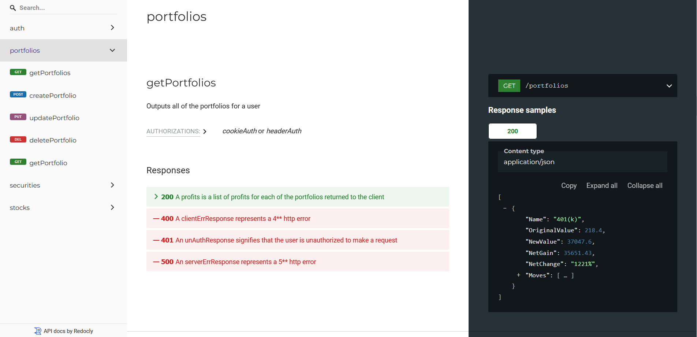

# STLKER
A stock tracking application that utilizes RESTful and gRPC microservices and other key components of backend programming.

## How it works?
The user sends a HTTP request to the control API's endpoint which then forwards it to the unary gRPC API. The gRPC API then sends a request to a third-party API, Alpha Vantage, and sends back the result to the user in a similar manner. If the user so wishes, they can interact with the gRPC service directly and call the unary functions as well as the ones that utilize bidirectional streaming, with the help of `grpcurl`.

## Current Features
* Utilizes a unary and streaming gRPC microservice as well as a RESTful one
* JWT authentication and HTTP cookies
* Extensive use of GORM to interact with a sqlite database
* Redis Caching
* Test cases

## Future Features
* Dockerization

## Current endpoints
* /portfolios (Requires authentication)
* /portfolios/{name} (Requires authentication)
* /portfolios/{name}/{ticker} (Requires authentication)
* /stocks/more/{ticker}
* /stocks/{ticker}/{currency}
* /signup
* /login
* /logout (Requires authentication)
* /refresh (Requires authentication)
* /deleteuser (Requires authentication)

## Documentation Sample


## Utilizing [`grpcurl`](https://github.com/fullstorydev/grpcurl)
To send a request directly to the unary rpc's, one needs to do the following:
```shell
  grpcurl --plaintext -msg-template -d '{"Ticker": "MSFT", "Destination":"USD"}' localhost:9090 Watcher/GetInfo
```
or
```shell
    grpcurl --plaintext -msg-template -d '{"Ticker": "MSFT", "Destination":"USD"}' localhost:9090 Watcher/MoreInfo
```
To send a request to the bidirectional rpc, one needs to do the following:
```shell
  grpcurl --plaintext -msg-template -d @ localhost:9090 Watcher/SubscribeTicker
```
This will create a connection that stays alive by which you can send many requests in the form of
```shell
  {"Ticker": "MSFT", "Destination": "EUR"}
```
and also be periodically updated with new stock price data. To terminate this connection a simple CTRL-C is sufficient.

## Disclaimer
This program is not intended to provide real-time stock information as it utilizes free publicly available API's by Alpha Vantage which provides information that is slightly delayed.

## License
© Furkan T. Ercevik

This repository is licensed with a [GNU GPLv3](LICENSE) license.
